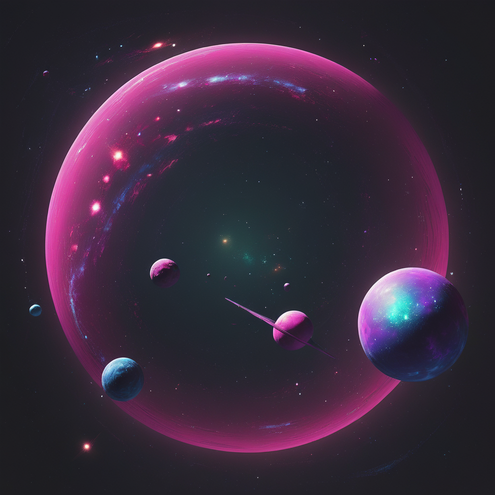

# 2024.1-Crystaleum-2

## Sobre
Muitos anos depois de Crys, neta do comandante Estelar Marsicano, ter combatido corporações perigosas, se unindo à sua facção e ao Comando Estelar e vencendo uma guerra galática através de suas lendárias missẽs, outra ameaça nos cerca. Agora, tendo como base uma documentação desatualizada e precária, você 🫵    
terá de restaurar a paz em Calamum Caeruleum. Como parte de uma facção guardiã, você terá de revisar os requisitos para o software que salvará a galáxia de uma destruição em massa, recrutando e treinando novos guardiões.

A ideia principal é que, em continuação ao Crystaleum 1.0, a galáxia terá de ser salva mais uma vez. Em contrapartida, nesta versão, o jogador será o protagonista num cenário de tomadas de decisão em um ambiente de desenvolvimento de software, com o foco na atividade de requisitos.
Cada etapa do jogo será correspondente a um "desafio-problema", onde o jogador enfrentará um desafio relacionado a gerenciamento de riscos, requisitos e tomadas de decisão do projeto.

## Equipe

<table>
  <tr>
    <td align="center"><a href="https://github.com/ aline-melo"> <b>Aline Melo</b></a> 
    <td align="center"><a href="https://github.com/antonioleaojr"> <b>Antonio Júnior</b></a> 
    <td align="center"><a href=" https://github.com/gravelylara "> <b>Lara Giuliana</b></a> 
    <td align="center"><a href=" https://github.com/AguionStryke "> <b>Lucas Freire</b></a> 
    <td align="center"><a href=" https://github.com/pedroyen21 "> <b>Pedro Yen  </b></a> 
    <td align="center"><a href="https://github.com/rayenealmeida"> <b>Thomas</b></a> 
    <td align="center"><a href="https://github.com/"> <b>Vitor</b></a> 
    
  </tr>
</table>