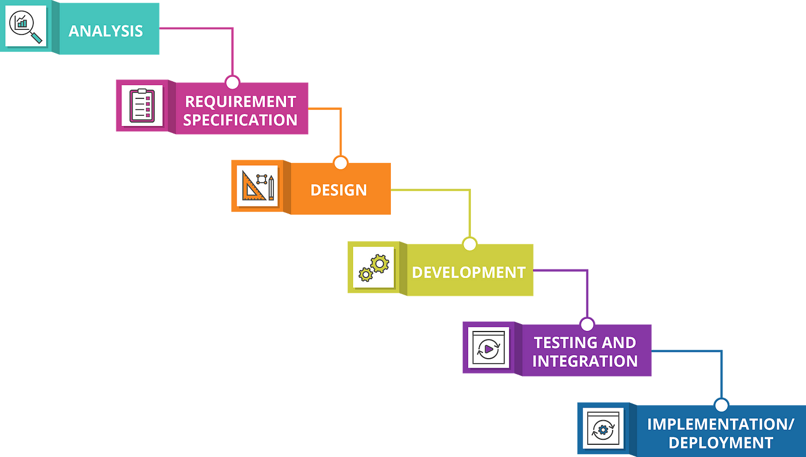
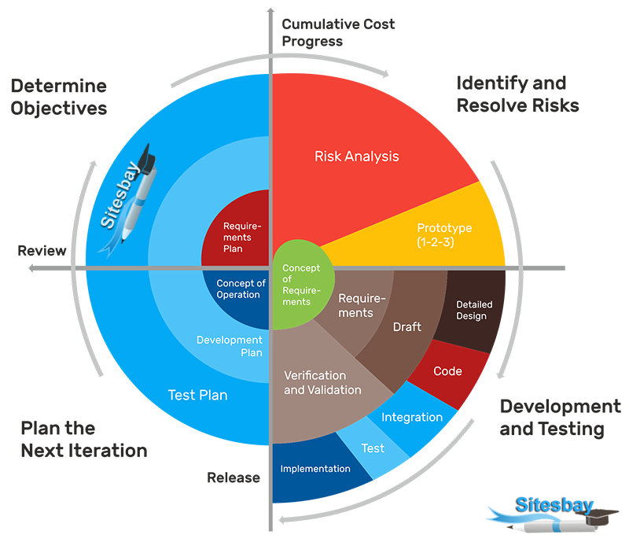

## Processos de Desenvolvimento e Ciclos de Vida

## Cascata:

- Faz parte da abordagem Dirigida por Plano;
- Implementa o ciclo de vida Preditivo;
- Requisitos fixos;
- Atividades bem definidas e sequenciais: uma atividade só pode acontecer depois que a anterior for completamente finalizada.

#### Vantagens:

- É resistente a mudanças na equipe: como todos as atividades são bem definidas e documentadas, a troca de participantes do projeto não é tão impactante.
- Estabilidade: resultados e prazos bem estabelecidos.

#### Desvantagens:

- Sensível a mudanças nos requisitos: depois que a etapa de especificação de requisitos é concluída, é mais difícil de integrá-los à implementação do sistema, afetando drasticamente o prazo e custo estipulados previamente;
- Entrega de valor só acontece no fim do processo.

[Fonte](https://rimitsen20.thkit.ee/wp/cascade-model-waterfall-model/)

### Espiral:

- Faz parte da abordagem Dirigida por Plano;
- Implementa o ciclo de vida Iterativo;
- Os requisitos são fixos e estabelecidos no decorrer dos ciclos;
- É fortemente dirigido pela análise de riscos que acontece no início de cada ciclo.

#### Vantagens:

- Menos propenso a concretização de possíveis riscos: como a análise de riscos é feita em toda iteração, é menos provável que hajam situações inesperadas e dificilmente remediáveis;
- Permite o feedback constante do trabalho;
- Mais tolerante com mudanças nos requisitos;

#### Desvantagens:

- Menor previsibilidade: como o número de iterações é indeterminado, é mais difícil prever o fim do projeto e o que exatamente será entregue;
- Maior complexidade: este processo é um dos mais complexos de ser planejado e executado;
- Muito dependente da análise de riscos: caso a análise de riscos não seja bem feita, há grandes chances do projeto ser desnecessariamente mais caro e sair do controle.

[Fonte](https://www.sitesbay.com/software-engineering/se-spiral-model)

## Processo Unificado:

- Possui um esforço inicial de planejamento e identificação de requisitos
- Busca identificar todos os requisitos no início do projeto
- É iterativo e incremental
- Por causa da natureza iterativa, há alguma flexibilidade para ajustes nos requisitos do projeto
- É implementado também algum grau de gestão de risco
- A colaboração entre Stakeholders, Desenvolvedores e Testers é incentivada em todos os momentos de desenvolvimento

#### Vantagens:

- Processo robusto e bem definido com a geração de artefatos importantes;
- Os maiores riscos são atacados primeiro, diminuindo as chances de fracasso do projeto

#### Desvantagens:

- Complexo e trabalhoso para projetos de pequeno porte;
- Exige experiência da equipe

## OpenUP (Open Unified Process):

- Variante do Processo unificado que busca ser mais ágil e reduzir os rituais e formalidades do UP.
- Incentiva colaboração e comunicação entre as equipes para gerar melhoria contínua.
- Equipes são incentivadas a abraçar as mudanças.

#### Vantagens:

- Mais escalável que o UP: prevê formas de se adaptar a projetos pequenos ou muito grandes.
- O feedback chega mais cedo, o que facilita a gerência de risco.

#### Desvantagens:

- O mesmo do Processo Unificado.
- Há um overhead maior para se usar o OpenUP.

## RAD:

- É considerada uma abordagem ágil, centrada no usuário e design do produto.
- Fortemente baseado no feedback do usuário.
- Os requisitos do produto são tratados como variáveis.
- Vários protótipos são feitos rapidamente para conseguir feedback dos stakeholders e refinar os requisitos.
- Há um maior grau de envolvimento do cliente, o que ajuda a sanar as suas necessidades e cumprir expectativas.
- Menos documentação formal

#### Vantagens:

- Altamente adaptável 
- Reduz o risco geral do projeto

#### Desvantagens:

- Imprevisibilidade de tempo e recursos a serem utilizados
- O RAD não é aconselhável quando os riscos técnicos são altos e não é indicada quando se está testando novas tecnologias
- Pode acidentalmente levar ao retorno das práticas caóticas no desenvolvimento

## Scrum XP:

- Framework que ajuda na organização de projetos para a construção de soluções adaptativas
- Os requisitos são tratados como variáveis   
- Atua de maneira evolutiva, com refinamentos sucessivos de requisitos e solução

#### Vantagens:

- Maior flexibilidade
- Entrega de valor incremental
- Maior transparência

#### Desvantagens:

- Requer uma equipe autogerenciável
- Necessidade de colaboração intensa
- Risco de sobrecarga de trabalho

## XP - eXtreme Programming:

- É uma metodologia baseada em comportamentos e atitudes.
- Equipes pequenas e médias.
- Orçamento e cronogramas previsíveis.
- Requisitos como variáveis.
- Uso de TDD: Test Driven Development.
- Amplo uso de CI/CD.
- Uso de pair programming.

#### Vantagens: 

- Simplicidade desde como se levanta os requisitos até a codificação
- Feedback contínuo entre desenvolvedores e clientes
- Flexibilidade, permite acomodar mudanças nos requisitos do projeto de forma eficiente
- Colaboração intensa, promove forte colaboração entre os membros da equipe, incluindo desenvolvedores, clientes e gerentes do projeto

#### Desvantagens: 

- Limitação em grandes projetos
- Necessidade de uma comunicação eficaz
- Falta de previsibilidade, devido a sua alta flexibilidade o XP pode acabar se tornando imprevisível

## DSDM:

- O DSDM (Dynamic Systems Development Method) é uma metodologia de desenvolvimento incremental e iterativa, ou seja, a cada nova etapa são feitas melhorias nas versões anteriores.
- Se divide em 3 etapas: Pré projeto (orçamentos e contratos), ciclo de vida(desenvolvimento e implementação),
