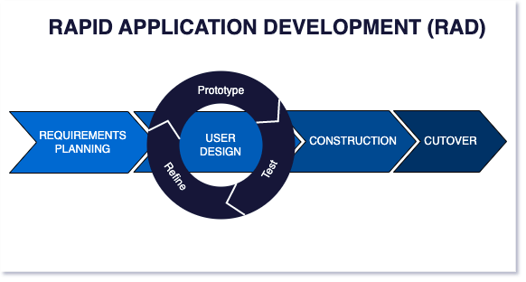

# Crystaleum 2

## Proposta De Processo de Desenvolvimento de Software

---

O nosso grupo optou por desenvolver o projeto com a **Abordagem Ágil**, **Ciclo de Vida Ágil** e **Processo de Desenvolvimento Rapid Application Development (RAD)**, por serem metodologias muito orientadas pelos feedbacks dos usuários, ter requisitos mutáveis e por sua agilidade e capacidade de desenvolver projetos não tão grandes com maior velocidade e entrega de valor. 

[Fonte](https://www.agilelonestar.com/knowledge-base/rapid-application-development)

Para nos auxiliar na tomada de decisão acerca de qual processo utilizar, nós tivemos como base os critérios propostos por Gupta, e levando em conta o quanto o projeto pode ser imprevisível e, dado que ainda estamos estudando as tecnologias a serem utilizadas, possivelmente teremos que adaptar o planejamento do projeto para adequa-lo à realidade do trabalho a ser executado.

Levando em consideração as tabelas de análise Gupta:

**Requisitos**

| Requirements                              | Waterfall | Prototype | Iterative | Evolutionary | Spiral | RAD | Crystaleum 2 |
|-------------------------------------------|-----------|--------|-----------|--------------|--------|-----|-------------------|
| Are requirements easily understandable and defined?  | Yes | No | No | No | Yes | No | No |
| Do we change requirements quite often?    | No | Yes | No | No | Yes | No  | No |
| Can we define requirements early in the cycle?  | Yes | No | Yes | Yes | No | Yes | Yes |
| Requirements are indicating a complex  system to be built   | No | Yes | Yes | Yes | Yes | No  | No |

---

**Time de Desenvolvimento**

| Development team                     | Waterfall | Prototype | Iterative enhancement | Evolutionary | Spiral | RAD | Crystaleum 2 |
|-------------------------------------|-----------|-----------|-----------------------|--------------|--------|-----|-----|
| Less experience on similar projects | No        | Yes       | No                    | No           | Yes    | No  | Yes |
| Less domain knowledge               | Yes       | No        | Yes                   | Yes          | Yes    | No  | Yes |
| Less experience on tools            | Yes       | No        | No                    | No           | Yes    | No  | No  |
| Availability of training            | No        | No        | Yes                   | Yes          | No     | Yes | Yes |

---

**Envolvimento dos Usuários**

| Involvement of Users                    | Waterfall | Prototype | Iterative | Evolutionary | Spiral | RAD | Crystaleum 2 |
|-----------------------------------------|-----------|-----------|-----------|--------------|--------|-----|-------------------|
| User involvement in all phases          | No        | Yes       | No        | No           | No     | Yes | Yes               |
| Limited user participation              | Yes       | No        | Yes       | Yes          | Yes    | No  | No               |
| Users have no previous experience of participation in similar projects | No        | Yes       | Yes       | Yes          | Yes    | No  |        No        |
| Users are experts of problem domain    | No        | Yes       | Yes       | No           | No     | Yes | Yes               |

--- 

**Tipo de projeto e riscos associados**

| Project type and risk                | Waterfall | Prototype | Iterative | Evolutionary | Spiral | RAD | Additional Column |
|-------------------------------------|-----------|-----------|-----------|--------------|--------|-----|-------------------|
| Project is the enhancement of the existing system     | No        | No        | Yes       | Yes          | No     | Yes | No               |
| Funding is stable for the project    | Yes       | Yes       | No        | No           | No     | Yes | Yes               |
| High reliability requirements        | No        | No        | Yes       | Yes          | Yes    | No  | No               |
| Tight project schedule               | No        | Yes       | Yes       | Yes          | Yes    | Yes | Yes               |
| Use of reusable components           | No        | Yes       | No        | No           | Yes    | Yes | Yes               |
| Are resource (time, money, people etc.) scarce?   | No        | Yes       | No        | No           | Yes    | No  | No               |

Com o auxílio das perguntas sugeridas por Gupta, a equipe chegou à conclusão de que o melhor processo a ser utilizado seria o RAD.

---

**Atividades de Desenvolvimento de Software**

| Nome da Atividade | Método | Ferramenta | Entrega |
|-------------------|--------|------------|---------|
| Elicitação | Brainstorming em equipe, reuniões JAD | Presencial / Discord | Documento de Requisitos |
| Desenvolvimento de Protótipos | Storyboard | Figma | Protótipo estático da interface |
| Análise e Negociação | Discussão entre membros e PO | Teams, Whatsapp, presencialmente | Backlog |
| Implementação | Desenvolvimento Ágil | Visual Studio Code | Código fonte |
| Validação | Feedback do PO | Por meio dos monitores da disciplina, email, Aprender3 | Backlog, entregas de missões |

---

**Referências Bibliográficas**

1. Unidade 1 - Aula - Escolhas da ESW.pdf - George Marsicano
2. Raja Gupta. Fundamentals of Software Engineering. Engineering Handbook. 2019

---

**Histórico de Versão**

| Data | Versão | Descrição | Autor |
|------|--------|-----------|-------|
| 08/04 | 1.0 | Proposta inicial | ALINE MELO OLIVEIRA, Antonio Jose Magalhaes Leao Junior, Lara Giuliana Lima dos Santos, Lucas Freire Lopes, Pedro Sena Barbosa Holtz Yen, THOMAS QUEIROZ SOUZA ALVES, VICTOR MOREIRA ALMEIDA |
|27/04| 1.1 | Mudança nas tabelas | Pedro Sena Barbosa Holtz Yen |