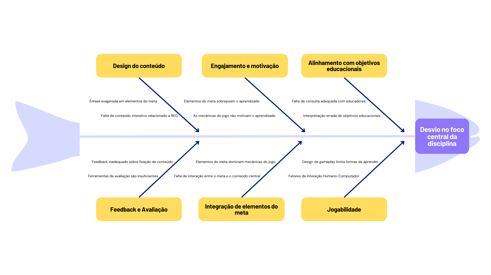

# VISÃO GERAL DO PRODUTO

## Problema

A matéria de Requisitos de Software se utiliza de uma gamificação centrada na narrativa da galáxia de Calamum Caeruleum, porém os alunos podem ter dificuldade em se engajar com a narrativa, o que pode diminuir seu interesse nas dinâmicas apresentadas e na matéria.

## Declaração de Posição do Produto

Nós nos dispomos a desenvolver um jogo mobile que aumentará o interesse dos alunos pela disciplina e facilitará que entendam o contexto da narrativa utilizada na gamificação. Diferente dos materiais do Super R, o nosso aplicativo apresentaria a narrativa de forma interativa e mais leve para os alunos. 

|  Dúvida              |       Resposta               |
|---------------------|--------------------------------------------------------------------|
| Para               | Alunos da disciplina de requisitos de software      |
| Quem                | Alunos com pouco interesse no material referente à gamificação      |
| O (nome do produto) | O Crystaleum 2 é um aplicativo mobile                               |
| Que                 | Que irá facilitar o interesse dos alunos pela dinâmica da disciplina|
| Ao contrário        | Ao contrário dos materiais tradicionais da disciplina               |
| Nosso produto       | Trará a narrativa de Calamus Caeruleum de forma interativa e divertida|

## Objetivos do Produto
Nosso objetivo central seria continuar a história iniciada em Crystaleum 1, expandindo nos temas da matéria e apresentando mais do universo de Calamum Caeruleum, para auxiliar os alunos a se integrarem acerca do contexto da matéria. Segundamente, gostaríamos de integrar o material de estudo da matéria para que ele possa servir de material de estudo ou revisão, assim como também ocorreu em Crystaleum 1.

REFERÊNCIAS BIBLIOGRÁFICAS
## Bibliografia
> CORRÊA, GEORGE MARSICANO. Material de aula, 2024.

## Histórico de Versões

| Versão |          Descrição    |     Autor(es)  |      Data  |   Revisor(es) |    Data de revisão    |  
|:------:|:---------------------:|:--------------:|:----------:|:-------------:|:---------------------:|
|  1.0   | Criação do documento  |                |            |               |                       |
|  1.0   | Publicação no git pages   |            |            |               |                       |
|  1.1   | Revisão e correção(?)  |               |            |               |                       |
=======
# Visão Geral do Produto

## **Problema**
Sabemos que a primeira iteração do jogo Crystaleum aumentou o interesse dos alunos pela disciplina. No entanto, o foco estava mais nos aspectos da história da gamificação do que na própria disciplina. Os minijogos e história principal foram feitos em forma de quizes sobre conteúdos da disciplina, mas à medida que o jogador progride na história, o jogo começa a tratar mais sobre o universo interno da gamificação do que sobre os conteúdos de Requisitos de Software.

Dessa forma, o problema principal que enxergamos é o de ensinar a disciplina de forma lúdica, sem nos perdermos na história.

O diagrama de Ishikawa (Fishbone) se provou útil por permitir uma avaliação com decisões bem informadas sobre diferentes aspectos do projeto sob uma visão macro:

Figura 1 - Diagrama de Ishikawa (Fonte: Thomas, 2024) 

